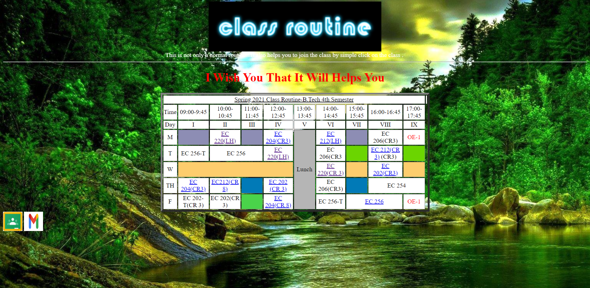

Online Class Routine 
===================================
Certainly! If you have a web page designed to facilitate students joining Google Meet classes with
A simple click on the class name can be a user-friendly and convenient way to streamline the process.

Pre-requisites
--------------

- HTML5
## How the web page could work:

1. Class Information: The web page would display a list of classes, typically with the class name, week, time, and subject code.

2. User Interface: The web page would have a clean and user-friendly interface where students can easily navigate and find their desired classes.

3. Clickable Class Names: Each class name listed on the web page would be clickable, typically implemented as a hyperlink. When a student clicks on a class name, it triggers an action.

4. Action: When a student clicks on a class name, the web page initiates an action to join the corresponding Google Meet session for that class.

5. Google Meet Integration: The web page would utilize the Google Meet link to join the specified Google Meet session associated with the class. This integration may require authentication with the student's Google account and appropriate permissions.

6. Joining the Class: After the web page initiates the action to join the Google Meet session, it would redirect the student to the Google Meet platform, where they can join the class and participate in the meeting.

Benefits and Convenience:
- Simplified Access: By providing clickable class names, the web page eliminates the need for students to manually search or type in the Google Meet URL for each class. It streamlines the process and reduces the chance of errors or confusion.
- Time Efficiency: Students can quickly navigate to the web page, find their desired class, and join the Google Meet session with just a few clicks, saving time and minimizing disruptions.
- User-Friendly Experience: The web page's intuitive interface and clickable class names enhance the user experience, making it more convenient for students to access their online classes.

Overall, the web page you described aims to streamline the process of joining Google Meet classes for students by providing a simple and efficient interface that eliminates the need for manual URL entry.
## Demo

## Features

- Google Meet.
- Google class room.
- Gmail.
- Class Routine.

## To Do

- Redirected to Respected class meet.
- Redirected to Google class.
- Gmail .

## Authors

- [@hemu33662](https://github.com/hemu33662)
